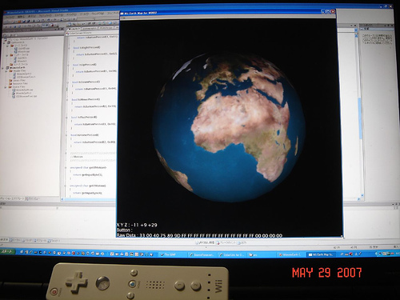

# Wiimote for C++

Wiimote for C++ is a developer library on WIN32 platforms. I would like to release the library for any platforms such as Linux and !MacOSX finally, but I have released it only for WIN32 platforms at the first release.



## References

- [Wiimote for C++ Userís Guide](doc/cgwiimotecc.pdf)

## Examples

The package includes the most simple sample which outputs data of a Wiimore to the standard console. The main source code is the following.

```
#include <stdio.h>
#include <cybergarage/wii/Wiimote.h>

using namespace CyberGarage;

int main( int argc, char *argv[] )
{
 Wiimote *wiimote;
 wiimote = new Wiimote();
 if (wiimote->open() == false) {
  delete wiimote;
  printf(";Could not find Wiimote !!";);
  return 0;
 }
 do {
  wiimote->read();
  printf(";\r%+d %+d %+d %s %s %s %s %s %s %s %s %s %s %s";,
   (wiimote->getXMotion()-0x80),
   (wiimote->getYMotion()-0x80),
   (wiimote->getZMotion()-0x80),
   (wiimote->IsAPressed() ? ";A"; : "; ";),
   (wiimote->IsBPressed() ? ";B"; : "; ";),
   (wiimote->IsOnePressed() ? ";1"; : "; ";),
   (wiimote->IsTwoPressed() ? ";2"; : "; ";),
   (wiimote->IsUpPressed() ? ";U"; : "; ";),
   (wiimote->IsDownPressed() ? ";D"; : "; ";),
   (wiimote->IsLeftPressed() ? ";L"; : "; ";),
   (wiimote->IsRightPressed() ? ";R"; : "; ";),
   (wiimote->IsMinusPressed() ? ";-"; : "; ";),
   (wiimote->IsPlusPressed() ? ";+"; : "; ";),
   (wiimote->IsHomePressed() ? ";H"; : "; ";)
   );
  Sleep(100);
 } while (wiimote->IsHomePressed() == false);
 wiimote->close();
 delete wiimote;
 return 0;
}
```
